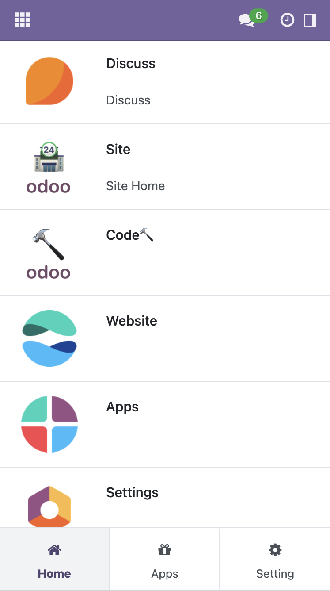

# OdooKit 🔨

      
 We build interesting tools help you developing Odoo Application 🚀

### Tools
-  [**Odoo Spy🕵️**](https://apps.odoo.com/apps/modules/17.0/kit_spy/): Help you insight into the rendering Templates of the Odoo web page,light up the template script,speed up development process🚀 
	#### Features
    
    
    
-  [**Odoo Code🔨**](https://apps.odoo.com/apps/modules/17.0/kit_code/): Help you build Odoo application online, super speed development process🚀
	#### Features
    
    
    
-  [**Odoo Site🏪**](https://apps.odoo.com/apps/modules/17.0/site): Expose native Odoo WebClient to Frontend Apps smoothly, handy seamless reuse the powerful capability of Odoo framework from outside SPA(Single-Page App) or PWA(Progressive Web App) 👌

     
    
     

	#### Features Usage

    - [Odoo WebClient](https://github.com/ixkit/odoo-webclient)
    - [Odoo Site App](https://github.com/icoco/odoo-site-app)

- kit_vest: rebranding, put 🎽 to 🏃

- one more thing ... 😎 

---

Enjoy & Happy Coding!  ☺︎

---

### Support Group ❤️

- QQ Group: [897048003](https://qm.qq.com/cgi-bin/qm/qr?k=_EQZwOGqzUd_pUtq_1HNaJGX-qW9tPdd&jump_from=webapi&authKey=EnU+5Ai74iVj4HvJS4+Q1ZonlWOOZHfPNZ264YekYMpj2fyMSMXtlvN70WMBwVzw)

- [Gitter](https://matrix.to/#/#odookit:gitter.im)